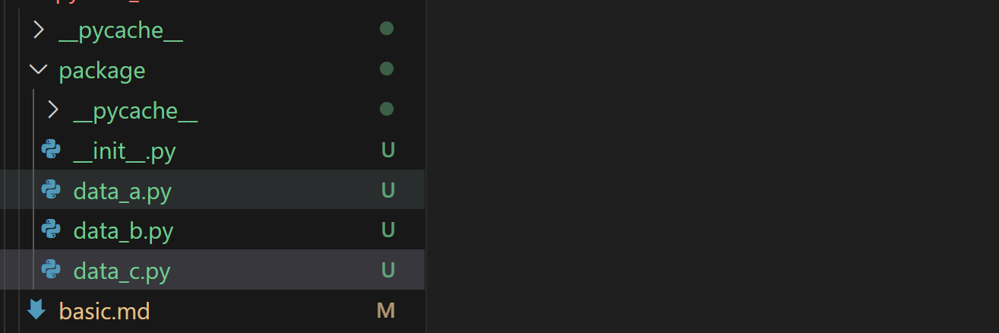

# 元类
## 类型对象（class 这个type）：
有一部分工作留到了运行时进行。这一节很复杂，暂时跳过。76
## 类的创建：
1. 类本省是一个code object.
2. 其次，code object的 co_const 带上所有的类内函数。
3. 在模块中 通过load build class 来创建.
## 类的property vs 函数静态变量
函数局部变量存在f_localplus，编译期间决定分配大小。所以跟类的动态是两种实现机制。
## metaclass 
### __new__ + __init__:
下面__new__函数根据cls 对象返回实例对象给__init__函数，也就是所谓的self
```py
class A:

    def __new__(cls, *args, **kwargs):
        print("__new__")
        # 这里的参数 cls 就表示 A 这个类本身
        # object.__new__(cls) 便是根据 cls 创建 cls 的实例对象
        return object.__new__(cls)

    def __init__(self):
        # 然后执行 __init__，里面的 self 指的就是实例对象
        # 执行 __init__ 时，__new__ 的返回值会自动作为参数传递给 self
        print("__init__")

A()
"""
__new__
__init__
"""

```
## metaclass:
```py
# type 接收三个参数：类名、继承的基类、属性
class A(list):
    name = "古明地觉"

# 上面这个类翻译过来就是
A = type("A", (list,), {"name": "古明地觉"})
print(A)  # <class '__main__.A'>
print(A.__name__)  # A
print(A.__base__)  # <class 'list'>
print(A.name)  # 古明地觉

```

metaclass就是一种type。
```py
class MyType(type):
    def __new__(mcs, name, bases, attr):
        print(name)
        print(bases)
        print(attr)

# 指定 metaclass，表示 A 这个类由 MyType 创建
# 我们说 __new__ 是为实例对象开辟内存的
# 那么 MyType 的实例对象是谁呢？显然就是这里的 A
# 因为 A 指定了 metaclass 为 MyType，所以 A 的类型就是 MyType
class A(int, object, metaclass=MyType):
    name = "古明地觉"
"""
A
(<class 'int'>, <class 'object'>)
{'__module__': '__main__', '__qualname__': 'A', 'name': '古明地觉'}
"""
# 我们看到一个类在创建的时候会向元类的 __new__ 中传递三个值
# 分别是类名、继承的基类、类的属性
# 但此时 A 并没有被创建出来
print(A)  # None

```
metaclass的__new__返回类的实例对象。也就是说，返回具体的A（比如有个classA）
attr负责类的所有方法+属性
###  __prepare__
必须是@classmethod,**返回的对象将会被并入attr**
```py
class MyType(type):
    def __new__(mcs, name, bases, attr):
        print(name)
        print(bases)
        print(attr)

# 指定 metaclass，表示 A 这个类由 MyType 创建
# 我们说 __new__ 是为实例对象开辟内存的
# 那么 MyType 的实例对象是谁呢？显然就是这里的 A
# 因为 A 指定了 metaclass 为 MyType，所以 A 的类型就是 MyType
class A(int, object, metaclass=MyType):
    name = "古明地觉"
"""
A
(<class 'int'>, <class 'object'>)
{'__module__': '__main__', '__qualname__': 'A', 'name': '古明地觉'}
"""
# 我们看到一个类在创建的时候会向元类的 __new__ 中传递三个值
# 分别是类名、继承的基类、类的属性
# 但此时 A 并没有被创建出来
print(A)  # None

```
### __init __subclass

```py

class Base:

    def __init_subclass__(cls, **kwargs):
        print(cls)
        print(kwargs)

# 当类被创建的时候，会触发其父类的__init_subclass__
class A(Base):
    pass
"""
<class '__main__.A'> 
{}
"""

class B(Base, name="古明地觉", age=16):
    pass

"""
<class '__main__.B'> 
{'name': '古明地觉', 'age': 16}
"""

```
类似元类的一种东西。 不同之处，元类在__new__无法访问子类。但是init_class可以访问实际的类（参数cls

```py
class Base:

    def __init_subclass__(cls, **kwargs):
        for k, v in kwargs.items():
            setattr(cls, k, v)

class A(Base, name="古明地觉", age=16,
        __str__=lambda self: "hello world"):
    pass


print(A.name, A.age)  # 古明地觉 16
print(A())  # hello world

```
# mro_entries:
继承实例对象返回的类型。

```py
class Base:

    def __init_subclass__(cls, **kwargs):
        for k, v in kwargs.items():
            setattr(cls, k, v)

class A(Base, name="古明地觉", age=16,
        __str__=lambda self: "hello world"):
    pass


print(A.name, A.age)  # 古明地觉 16
print(A())  # hello world

```

# descriptor:
```py
 __get__、__set__、__delete__  三个方法出现其中一个

```
```py
class Descriptor:

    def __get__(self, instance, owner):
        print("__get__")
        print(instance)
        print(owner)

    def __set__(self, instance, value):
        print("__set__")
        print(instance)
        print(value)


class Girl:
    # 此时的 name 属性就被描述符代理了
    name = Descriptor()

    def __init__(self, name, age):
        self.name = name
        self.age = age

g = Girl("satori", 16)
"""
__set__
<__main__.Girl object at 0x0000021D8D225E40>
satori
"""

```
## dict详细解释：
```py
class A:
    def add(self):
        return 1 + 1
    
a = A()
print(A.__dict__)
print(a.__dict__)
```
注意 方法是在类的dict，而不是实例的dict
## 优先级
数据描述符：__set__
非数据：不带set的
非数据优先级< 实例属性 < 数据描述符 < 类属性
类属性可以覆写描述符属性。也就是通过class.Des = ..可以覆写掉整个描述符，子类将无法再使用描述符。
## 实例和类 都可以访问同一个描述符，区别是instance 是否None

## 
```py
class Descriptor:
    def __get__(self, instance, owner):
        print("Getting value")
        return "value"
    def __set__(self, instance, value):
        print("Setting value")
        instance.name = value


class A:
    name = Descriptor()


a = A()

a. name = 123
print(a.__dict__)
```
无限循环。
注意设置属性最好这样>instance.__dict__[]= xxx
或者设置到描述符上面
## set_name onwer是类，name 是属性名
```py
class Descriptor:

    def __get__(self, instance, owner):
        return instance.__dict__["name"]

    def __set__(self, instance, value):
        instance.__dict__["name"] = value

    def __set_name__(self, owner, name):
        print(owner)
        print(name)


class Girl:
    age = Descriptor()

"""
<class '__main__.Girl'>
age
"""

```


## 有意思，type checker:
```py
class TypeChecker:

    def __init__(self, name, excepted_type):
        self.name = name
        self.excepted_type = excepted_type

    def __get__(self, instance, owner):
        return instance.__dict__[self.name]

    def __set__(self, instance, value):
        if not isinstance(value, self.excepted_type):
            tp = type(value).__name__
            excepted_tp = self.excepted_type.__name__
            raise TypeError(f"{self.name} 接收的值应该是 {excepted_tp} 类型，而不是 {tp} 类型")

        instance.__dict__[self.name] = value


def type_checker(cls):
    # cls 就是要被 type_checker 装饰的类
    # 拿到 __init__ 函数
    __init__ = getattr(cls, "__init__", None)
    # 如果 __init__ 为空，或者它不是一个函数，那么直接将类返回
    if __init__ is None or not hasattr(__init__, "__code__"):
        return cls

    # 拿到 __init__ 函数的 __annotations__
    annotations = cls.__init__.__annotations__
    # 进行遍历，给类设置被描述符代理的属性
    for name, excepted_type in annotations.items():
        setattr(cls, name, TypeChecker(name, excepted_type))
    return cls


# 以后在创建类的时候，直接打上这个装饰器就行了
# 但是显然这个装饰器依赖类型注解
# 如果没有类型注解的话，那么该属性是不会被代理的
@type_checker
class Girl:

    def __init__(self, name: str, age: int):
        self.name = name
        self.age = age

try:
    g = Girl(16, 16)
except TypeError as e:
    print(e)  # name 接收的值应该是 str 类型, 而不是 int 类型

```
### 实现中出现的错误:
```py
class EmptyClass:
    ...
# print(EmptyClass.__dict__)
class TypeChecker:
    def __init__(self, expected_type: type):
        self.expected_type = expected_type

    def __set__(self, instance, value):
        if not isinstance(value, self.expected_type):
            raise TypeError(
                f"Hope to get {self.expected_type},but get {type(value)}")
        else:
            # print(type(instance))
            instance.__dict__[self.name] = value

    def __get__(self, instance, owner):
        return instance.__dict__[self.name]

    def __set_name__(self, owner: type, name: str):
        self.class_type = owner
        self.name = name


def type_check(cls:type)->type:
    
    __init__ = cls.__init__
    try:
        init_annotation = __init__.__annotations__
    except:
        return cls
    _dict_ = {
        k:v  for k,v in cls.__dict__.items() if k not in EmptyClass.__dict__
    }
    for k,v in init_annotation.items():
        _dict_[k] = TypeChecker(v)
        ...
        
    return type(cls.__name__,cls.__bases__,_dict_)    


@type_check
class Test:
    def __init__(self,name:str,age:int):
        self.name = name
        self.age = age
print(Test.__dict__)
Test()


```
显示descriptor __dict__ can apply to test.
这是因为把旧的mapproxy discriptor 带到新的类了，所以报错。
推测 mapproxy中有一些特别的检查》 
# method vs func:
```py
<function Test.class_func at 0x73c5c4c41300>
<bound method Test.class_func of <__main__.Test object at 0x73c5c4dff5f0>>
```
注意A.fuc 和 a.func的重要区别，原因是对于func是个描述符，会判断当前是有什么调用的，实例调用会有包装。
# classmethod底层实现原理。
classmethod是一个内置函数。
会进行类似make_method的绑定操作。
只不过，绑定的是类。与普通a.method别无二至。

# class vs module:
首先在这里我们必须强调一点，一个单独的 .py 文件、或者 .pyc 文件、.pyd 文件，我们称之为一个模块 ；而多个模块组合起来放在一个目录中，这个目录我们称之为包。但不管是模块，还是包，在虚拟机的眼中，它们都是 PyModuleObject 结构体实例，类型为 PyModule_Type，而在 Python 中则都是一个 <class 'module'> 对象。
## 动态导入：
```py
# 有一个文件 F:\mashiro\test.py，我们如何才能将它导入进来呢？
from importlib.machinery import SourceFileLoader

# 第一个参数是模块名，第二个参数是模块的路径
# 这样就可以实现导入了，所以这是基于文件路径进行加载的
# 这个做法能够保证无论文件在什么地方，都可以进行导入
test = SourceFileLoader("test", r"F:\mashiro\test.py").load_module()

# 但有一点需要注意，如果是导入包的话，那么要导入包里面的 __init__.py 文件
pd = SourceFileLoader(
    "我是 pandas 模块",
    r"C:\python38\lib\site-packages\pandas\__init__.py"
).load_module()
print(pd.DataFrame({"a": [1, 2, 3], "b": [4, 5, 6]}))
"""
   a  b
0  1  4
1  2  5
2  3  6
"""
# 如果只写到 pandas，那么会抛出 PermissionError，因为我们不能把目录当成文件来读取
# 至于 import 一个包，本质上也是加载包内部的 __init__.py 

# 但上面这个类只能加载 py 文件，如果想加载 pyc、pyd 文件，需要用下面两个类
# 但需要注意的是，加载普通文件和 pyc 文件时，我们可以随便起名字，也就是第一个参数任意
# 但对于 pyd 文件，第一个参数必须和 pyd 文件的名字保持一致。
from importlib.machinery import SourcelessFileLoader  # pyc
from importlib.machinery import ExtensionFileLoader   # pyd
    

或者:
import importlib

a = "pandas"
pd = importlib.import_module(a)
# 很方便地就导入了，直接通过字符串的方式导入一个 module 对象
print(pd)  
"""
<module 'pandas' from 'C:\\python38\\lib\\site-packages\\pandas\\__init__.py'>
"""

# 如果想导入 "模块中导入的模块"
# 比如: 模块 a 中导入了模块 b，我们希望导入 a.b
# 或者导入一个包下面的子模块，比如 pandas.core.frame
sub_mod = importlib.import_module("pandas.core.frame")
# 我们看到可以自动导入 pandas.core.frame
print(sub_mod)  
"""
<module 'pandas.core.frame' from 'C:\\python38\\lib\\site-packages\\pandas\\core\\frame.py'>
"""

# 但如果是 __import__，默认的话是不行的，导入的依旧是最外层的 pandas
print(__import__("pandas.core.frame"))
"""
<module 'pandas' from 'C:\\python38\\lib\\site-packages\\pandas\\__init__.py'>
"""
# 可以通过给 fromlist 指定一个非空列表来实现
print(__import__("pandas.core.frame", fromlist=[""]))
"""
<module 'pandas.core.frame' from 'C:\\python38\\lib\\site-packages\\pandas\\core\\frame.py'>
"""

```
## 生成模块。
只需要在对应的地方exec代码，替换明明空间就可以
# 模块导入：
内置模块。都在sys.modules 这些是原生的，都是以C的形式写死在代码里，手动import 也是同一个。
值得注意的是，外置module再加载的时候也会进入这个dict。
**这在一定程度上带来了防止重复加载的好处**
## main 也是个module：
```py
import exp

import sys


print(dir(exp))
print(dir())
print([i for i in dir() if i not in dir(exp)])

print(__annotations__)
```
发现dir()当前空间多了一个__anotations__
# package vs module：
```py
此时又看到了神奇的地方，我们在 test_import 目录里面创建了 __init__.py 之后，再打印 test_import，得到的结果又变了，告诉我们这个包来自于包里面的 __init__.py 文件。所以就像之前说的，Python 对包和模块的概念区分的不是很明显，我们就把包当做该包下面的 __init__.py 文件即可，__init__.py 中定义了什么，那么这个包里面就有什么。
```
# 相对导入 与包：
```py
我们发现报错了，提示没有 a 这个模块，可是我们明明在包里面定义了呀。还记得之前说的导入一个模块、导入一个包会做哪些事情吗？导入一个模块，会将该模块里面的内容 "拿过来" 执行一遍，导入包会将该包里面的 __init__.py 文件 "拿过来" 执行一遍。注意：这里把 "拿过来" 三个字加上了引号。

我们在和 test_import 目录同级的 py 文件中导入了 test_import，那么就相当于把里面的 __init__ 拿过来执行一遍（当然只有第一次导入的时候才会这么做）。但是它们具有单独的空间，是被隔离的，访问时需要使用符号 test_import 来访问。

但是正如之前所说，是 "拿过来" 执行，所以这个 __init__.py 里面的内容是"拿过来"，在当前的 .py 文件（在哪里导入的就是哪里）中执行的。所以由于 import a 这行代码表示绝对导入，就相当于在当前模块里面导入，会从 sys.path 里面搜索，但模块 a 是在 test_import 包里面，那么此时还能找到这个 a 吗？显然是不能的，除非我们将 test_import 所在路径加入到 sys.path 中。

那 from . import a 为什么就好使呢？因为这种导入方式是相对导入，表示要在 __init__.py 所在目录里面找，那么不管在什么地方导入这个包，由于 __init__.py 的位置是不变的，所以 from . import a 这种相对导入的方式总能找到对应的 a。
```


**使用相对导入的模块（往往处于包内部） 不能和执行的模块（__main__）在同一个目录下**  
见上，data_c中导入了data_b，而data_b中使用了相对导入语法：
```py
# data_b.py
from .data_a import a
b = a
```


# 执行长链import：
import a.b.c
会导入a 
b
c
但是使用的时候必须带着链条去用 不能 b... c.. 只可以 a.b.c  


**实际上，我们一般用的是from xx import xx 完美解决这个问题**
```py
import sys
# test_import 是一个目录，里面有一个 __init__.py 和一个 a.py
# 在 __init__.py 中导入了 a.py
from test_import import a

print(sys.modules.get("test_import") is not None)  # True
print(sys.modules.get("test_import.a") is not None)  # True
print(sys.modules.get("a") is not None)  # False

```
但是，实际上也是导入了父类包，这是无法绕过的。只是用不了了
# 路径搜索机制
一个包下的其余模块会通过package.__path__去搜索（是package 所在目录），而不是按照python的所有搜索路径
```py
import six
import numpy as np
import numpy.core

print(np.__name__, np.__path__) 
"""
numpy ['C:\\python38\\lib\\site-packages\\numpy']
"""

print(np.core.__name__, np.core.__path__)
"""
numpy.core ['C:\\python38\\lib\\site-packages\\numpy\\core']
"""

print(six.__name__, six.__path__) 
"""
six []
"""

```
__path__是package 特有机制
# __file__:
一般情况，就是当前文件的路径，对于package 就是 __init__.py的路径

# 模块也有缓存池
一旦被import，修改将不复起效，需要importlib.reload

# 小总结。
不管什么导入。都会在sys.modules[]里存入长链路径格式，这是为了避免重复导入...
另外，不同的导入方式只是暴露的不同 ，也就是globals()不同

# 线程与进程
1. 多个线程共享进程的同一份sys和builtins 以及一些内置的函数 库。
2. 内置函数的添加是在inter初始化的过程中进行的。
/usr/lib/python3.12/site.py

## GIL：
GIL锁的是字节码。
```py
import threading

a = 0

def func1():
    global a
    for i in range(1000):
        a = a + 1

threadPool = []
for i in range(1000):
    threadPool.append(threading.Thread(target=func1))
for t in threadPool:
    t.start()
for t in threadPool:
    t.join()

print(a)

          

```
however,i dont find the bug here.
### 释放GIL：
做的操作有：
- 保存线程状态。（保存Py级别的数据）
- 释放GIL：
- 执行C操作。
- 获得GIL

### GIL 的产生:
```py
然后我们还看到了多线程环境的初始化动作，从这里可以看出，在开启多线程之前，支持多线程的数据结构、以及 GIL 都还没有创建。因为对多线程的支持是需要代价的，如果上来就激活了多线程，但是程序却只有一个主线程，那么 Python 仍然会执行所谓的线程调度机制，只不过调度完了还是它自己，所以这无异于在做无用功。因此 Python 将开启多线程的权利交给了程序员，自己在启动的时候是单线程，既然是单线程，自然就不存在线程调度了，当然也没有 GIL。

而一旦调用了 threading.Thread(...).start()，底层对应 _thread.start_new_thread()，则代表明确地指示虚拟机要创建新的线程。这个时候虚拟机就知道自己该创建与多线程相关的东西了，比如数据结构、环境、以及那个至关重要的 GIL。
```

###  GIL的作用机制：

take_gil,和drop_gil .  
首先gil的产生源于thread的new 。
在eval_frame主for 循环里，最开始的是获取GIL 以及释放GIL的操作，  
take_gil尝试获取GIL，然后在一个while循环内部，不断判断运行时间，如果运行时间过长，会设置当前GIL的一个变量为1 ，使得获取GIL的进程下次进入开头的时候释放掉GIL，同时该释放GIL的进程再次调用take_gil从而阻塞。


# 属性访问的字节码：
```py
  // 加载变量 g
 20 LOAD_NAME                1 (g)
  // 获取 g.name，加载属性用的是 LOAD_ATTR
 22 LOAD_ATTR                2 (name)
  // 将结果交给变量 name 保存
 24 STORE_NAME               2 (name)
  
  // g.get_info() 对应的字节码
  // 加载变量 g
 26 LOAD_NAME                1 (g)
  // 获取方法 g.get_info，加载方法用的是 LOAD_METHOD
 28 LOAD_METHOD              3 (get_info)
  // 调用方法，注意指令是 CALL_METHOD，不是 CALL_FUNCTION
  // 但显然 CALL_METHOD 内部也是调用了 CALL_FUNCTION
 30 CALL_METHOD              0
  // 从栈顶弹出返回值
```
一个是LOAD_METHOD 另一个是LOAD_ATTR
